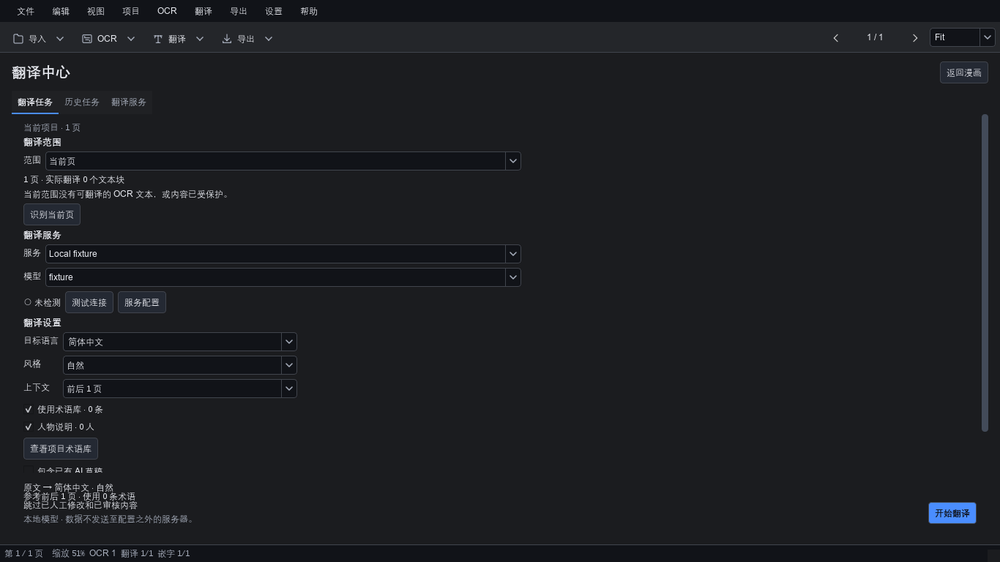
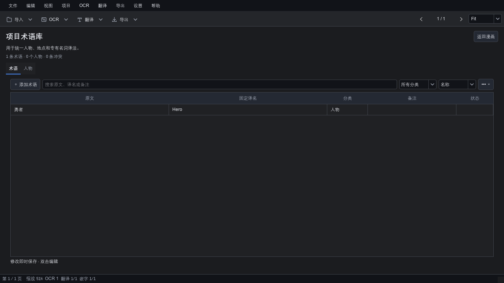
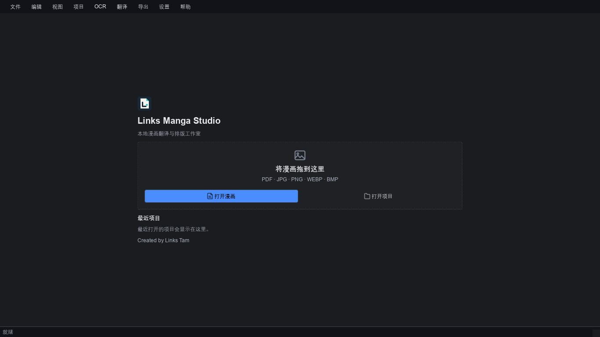

# Links Manga Studio

Local-first manga OCR, translation, cleaning and typesetting studio for Windows.

Created by Links Tam.

English | [简体中文](README.zh-CN.md)

  [](LICENSE) 

Import images, folders or PDFs; review OCR, translate, clean text regions, typeset and export. **Manual translation works without an API key or a translation service.**

## Workspace


Pages and batches on the left, canvas in the middle, text and layout properties on the right. The workflow follows import → OCR → source export → cleaning → typesetting → export.


## Translation Center

Optional translation drafts use your own cloud API account or an external local model server. The app does not bundle an LLM or download model weights. Review drafts; existing manual translations are protected by default.



Project terminology and character notes help keep names consistent.



## Start

Download the Windows ZIP from this repository's **Releases** page, extract the entire folder and run **LinksMangaWorkspace.exe**. Do not run it inside the ZIP.



All five screenshots show original synthetic content. See [Quick start](QUICK_START.md), [user guide](USER_GUIDE.md) and [简中详细指南](docs/USER_GUIDE.zh-CN.md).

Source development:

```powershell
py -3.12 -m venv .venv
.\.venv\Scripts\python.exe -m pip install -e ".[imaging,test]"
.\.venv\Scripts\python.exe -m app.main
```

The tested release build uses Python 3.12. See [Developer guide](docs/DEVELOPER_GUIDE.md) for tests and packaging.

## Data and privacy

Projects are local `.lmw` folders with SQLite, source references/copies and derived assets. Copy mode keeps project-owned files; Reference mode depends on original paths. Keep a complete backup before upgrades.

OCR and manual editing run locally. Cloud translation sends selected text and enabled context to the configured service. Local translation requires a server you install and start separately. API keys use Windows Credential Manager, not project storage.

## Release boundaries

Automated tests use synthetic documents and mock translation services. Real paid APIs, real local models and visible Windows DPI/UX require user acceptance. PDF page import is supported; final export formats are those available in the export dialog. See [release notes](RELEASE_NOTES_0.6.0.md).

## License and contribution

App source: Apache-2.0. Dependencies and OCR models retain their own licenses: [third party notices](THIRD_PARTY_NOTICES.md), [model licenses](MODEL_LICENSES.md), [license review](LICENSE_REVIEW.md).

[Architecture](docs/ARCHITECTURE.md) · [Contributing](CONTRIBUTING.md) · [Security](SECURITY.md) · [Code of conduct](CODE_OF_CONDUCT.md)
