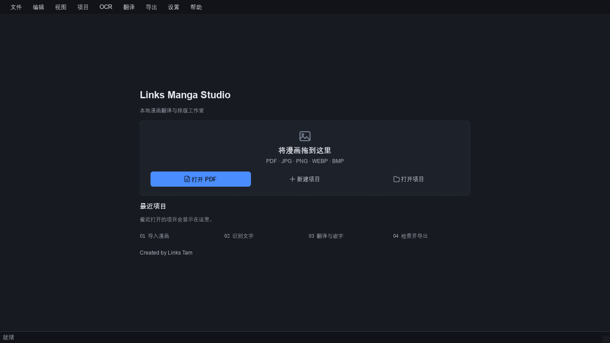
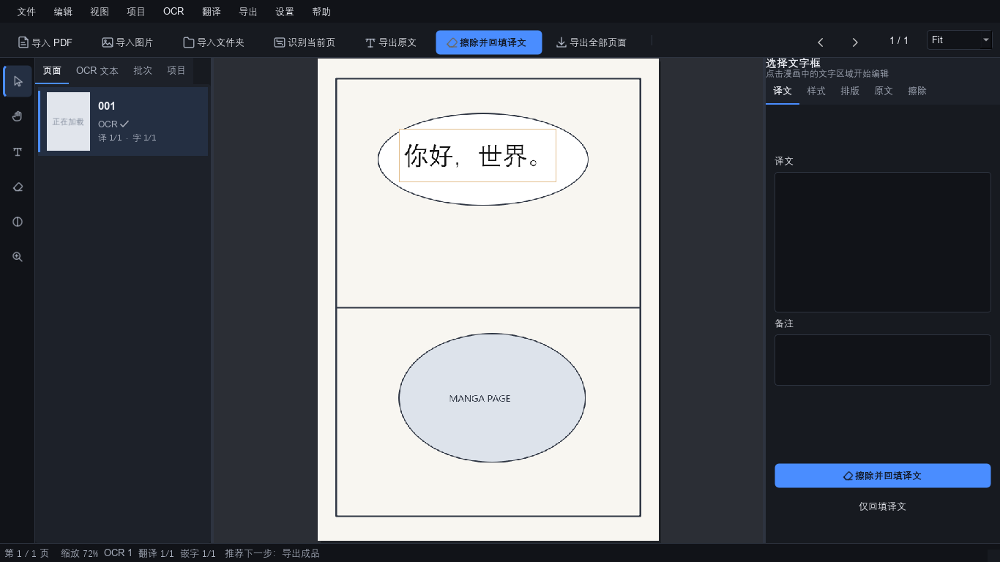
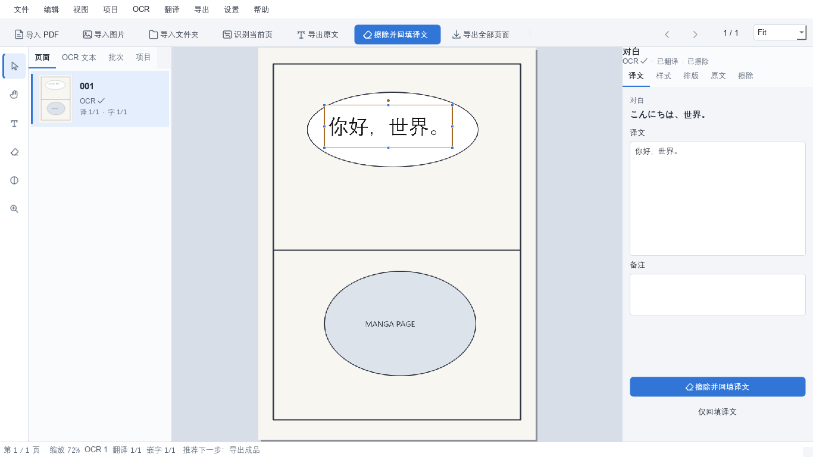

<p align="center"></p>

# Links Manga Studio

[English](README.md) | [简体中文](README.zh-CN.md)

本地优先的漫画 OCR、翻译、擦字与嵌字桌面工作室。Created by **Links Tam**。

  [](LICENSE)

**v0.5.0 — Initial Public Release 候选版。** GitHub 由作者手动发布；不显示未经验证的 CI 成功或已发布标记。

本地处理、人工翻译优先、非破坏编辑：内置工作流不会自动上传漫画，默认无遥测，不要求云账户或翻译 API。图片和文字保存在 `.lmw` 项目中。

目录：[截图](#截图) · [功能](#功能) · [快速开始](#快速开始) · [工作流](#工作流) · [字体](#字体) · [性能](#大型项目基准) · [开发](#开发) · [限制](#已知限制) · [许可证](#许可证与致谢)

## 截图

### 深色主题




### 浅色主题



全部使用原创合成示例，不含商业漫画。[字体浏览器](docs/ui_snapshots/0.5.0/font_browser.png) · [质量检查](docs/ui_snapshots/0.5.0/quality_check.png)

## 功能

### 导入与项目

- PDF、图片、文件夹与拖拽导入，PDF 可直接创建项目。
- 延迟缩略图、有上限的缓存、大项目浏览与批次管理。
- 复制到项目或引用原路径，引用丢失时提示。

### OCR

- 本地 RapidOCR CPU 推理，随包 ONNX 模型。
- 原文校对、置信度信息、稳定 Text UID、原始结果持久化。

### 翻译

- 在文本框中手动编辑译文。
- DOCX 导出/导入，用稳定协议映射，不依赖显示标题。

### 擦字与排版

- 擦除、蒙版、擦除并回填，不删除原 TextBlock。
- 项目字体、样式角色、框级覆盖、Auto Fit、中文标点换行。

### 质量与工作流

- 具名撤销/重做，检查缺失译文和溢出。
- 深色/浅色/系统主题，中英文界面。
- PNG/JPEG/WEBP 导出，不添加软件或作者水印。

## 快速开始

要求 Windows 10/11 x64；便携版不需要 Python。作者发布后，从 GitHub Releases 下载 ZIP 和 SHA256，本页不假定仓库账户或尚不存在的链接。

1. 下载并核验 ZIP 的 SHA256。
2. 完整解压，保持 `runtime/` 与 `LinksMangaWorkspace.exe` 同级。
3. 运行 EXE；旧文件名用于兼容，产品名称是 Links Manga Studio。
4. 拖入 PDF、图片或文件夹。
5. OCR 后校对原文。
6. 手动输入译文或通过 DOCX 批次交换。
7. 擦除并回填，运行质量检查。
8. 导出成品。

Copy Into Project 把原图放进项目；Reference Original Files 记录路径和哈希。备份 `.lmw` 和引用的外部素材。

## 工作流

导入 → OCR → 翻译 → 擦除并回填 → 质量检查 → 导出

擦除后保留 Text UID，译文与样式仍属于同一框。核心修改立即写入 SQLite 事务。见 [架构](docs/ARCHITECTURE.md)。

## 字体

项目字体样式支持可复用角色。相似字体推荐提供视觉匹配；栅格漫画通常没有原字体元数据，因此不保证精确恢复字体。项目不分发用户安装的字体。

## 大型项目基准

此前内部合成千页图片测试：预检约 11.225 秒、数据库提交约 1.19 秒、首次可交互约 0.217 秒、抽样切页中位延迟约 9.71 毫秒；16 MB 缓存压力测试保持有界。这是历史测量，不是所有电脑的性能承诺；硬件、原图大小和环境都会影响结果。本轮文档调整没有重跑重型基准。

## 开发

Windows，Python 3.11 或 3.12：

```powershell
python -m venv .venv
.\.venv\Scripts\python.exe -m pip install -e ".[test,imaging]"
.\.venv\Scripts\python.exe -m app.main
```

### 测试

```powershell
$env:QT_QPA_PLATFORM = 'offscreen'
.\.venv\Scripts\python.exe -m pytest -q --ignore=tests/test_full_workflow.py
```

排除的端到端测试生成并导出千页合成素材，相关修改时再运行。PDF 测试使用已有 PDFium/Qt，不需要 PyMuPDF。CI 不依赖仓库 Secret；GitHub 实际状态须在 Push 后确认。

### Windows 打包

```powershell
.\.venv\Scripts\python.exe -m pip install -r requirements-build-win-py312.txt
powershell -NoProfile -ExecutionPolicy Bypass -File tools/build_release.ps1
```

固定已观察的构建版本，不承诺逐字节一致。便携包附带 LICENSE、NOTICE 和第三方许可证。dist 和模型不进入源码 Git，ZIP 通过 Release 分发。见 [贡献](CONTRIBUTING.md)、[安全](SECURITY.md)、[手动发布指南](docs/MANUAL_GITHUB_PUBLISH.md)。

## 已知限制

- Windows 优先；macOS/Linux 尚未验证。
- 日文 OCR 受模型和原图质量影响，需要人工校对。
- 复杂背景需手动修蒙版；竖排持续完善。
- 相似字体推荐不保证找回原字体。
- 每次发布建议真实可见窗口人工验收。
- 系统主题在启动/选择时读取，不保证即时跟随系统变化。
- 便携 EXE 未签名。

软件不提供漫画内容，使用者负责取得处理与传播素材的授权。见 [路线图](ROADMAP.md)、[更新记录](CHANGELOG.md)，不承诺日期。

## 许可证与致谢

Links Manga Studio 采用 **Apache License 2.0**。遵守其条款即可使用、复制、修改、再分发、制作衍生作品及商业使用；不要求所有 Fork 或修改都公开源码。

见 [LICENSE](LICENSE)、[NOTICE](NOTICE)。第三方组件和模型保留各自版权与条款，详见 [第三方通知](THIRD_PARTY_NOTICES.md)、[模型许可](MODEL_LICENSES.md)。感谢 Qt/PySide6、PDFium、RapidOCR/PaddleOCR、ONNX Runtime、OpenCV、Pillow、python-docx、NumPy 和 fontTools；贡献者保留其贡献的权利。
